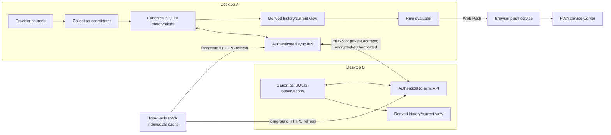
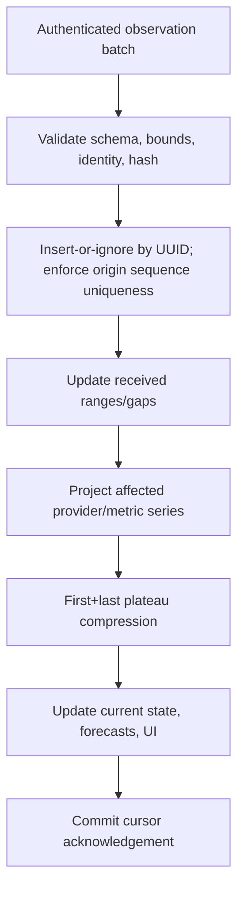
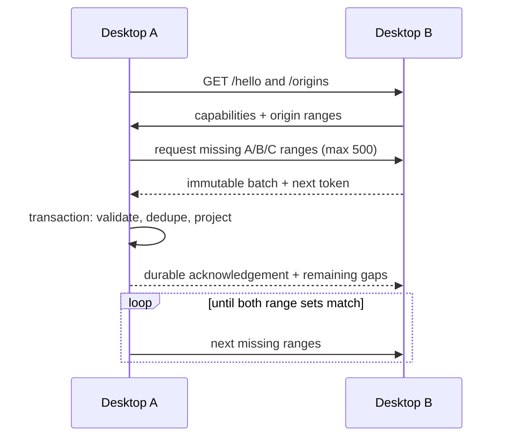
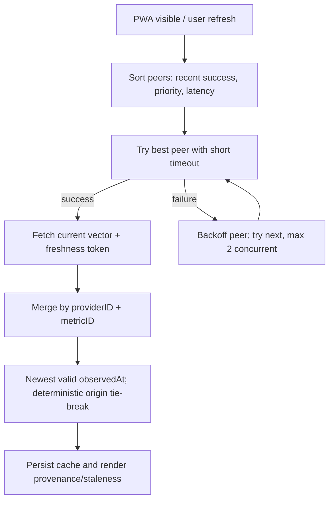
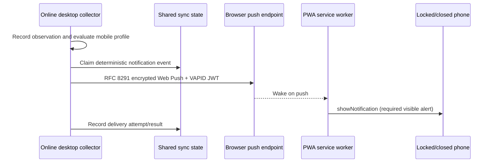
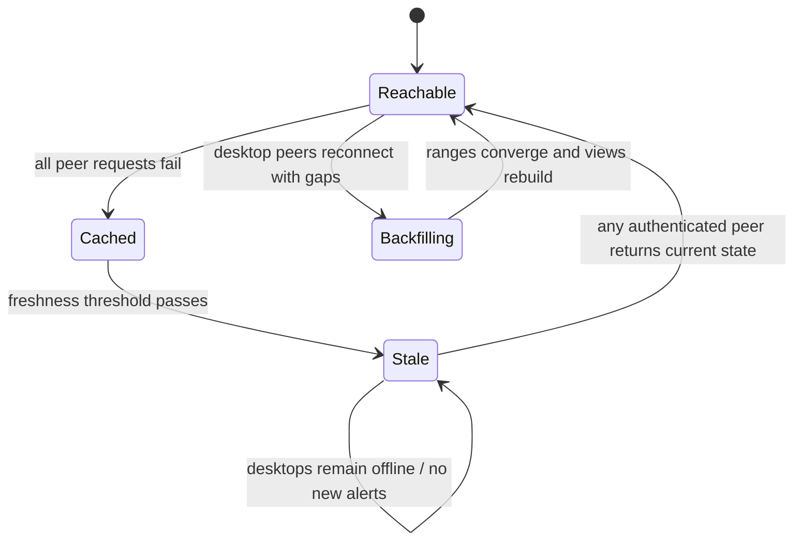

# Rashun local-first multi-device sync and mobile PWA plan

Status: implementation-ready architecture plan; no production implementation. Audited branch: `ah/multi-device` at `a39d2bb` on 2026-07-13.

## 1. Executive summary

Rashun should not synchronize its existing `[String: [UsageSnapshot]]` JSON blob. That representation has no stable record identity or provenance, mutates the end of equal-value runs, caps every series at 10,000 points, physically deletes data, and is vulnerable to last-writer-wins loss between the CLI and macOS app. Synchronizing it would produce loops, irrecoverable gaps, and ambiguous source/metric identity.

Add a cross-platform `RashunSync` library backed by SQLite. It owns a stable device identity, an immutable canonical observation log, peer credentials and cursors, and materialized current/compressed-history views. Each accepted provider poll becomes one `UsageObservation` with a random UUID and a monotonically increasing sequence in the local origin's transaction. Peers exchange immutable observations by `(originDeviceID, originEpoch, originSequence)` ranges and deduplicate by `observationID`. The vector of per-origin contiguous high-water marks is simpler and safer than timestamps or a global cursor. Gaps are explicit and retried.

The existing plateau compression becomes a deterministic derived-view operation after canonical merge; raw observations remain the sync truth. Forecasts, current state, and notification evaluations are recomputed locally. Version 1 does not sync credentials, settings, raw provider payloads, forecasts, tracking sessions, or notification history.

Desktop nodes advertise with mDNS, expose an authenticated API, pair through an explicit short-lived challenge/confirmation flow, and sync opportunistically. Use Hummingbird 2 for the embedded Swift HTTP service, `Network.framework` Bonjour on macOS, and a small cross-platform DNS-SD abstraction (system Bonjour/Avahi on Linux and DNS-SD/WinDNS on Windows). Use SQLite through GRDB on Apple/Linux; validate GRDB's Windows support before committing—otherwise isolate a thin SQLite C API repository so the protocol layer is unchanged.

The minimum secure mobile product is an installed PWA served from a stable, trusted HTTPS origin. A static public shell with no account/backend can provide that origin, but direct fetches from it to HTTP LAN peers are blocked by mixed-content/security policy and increasingly constrained by local-network access rules. The reliable private deployment is a same-origin desktop-served PWA/API behind Tailscale Serve HTTPS. A zero-configuration LAN HTTPS story requires a product-level certificate solution that does not currently exist; self-signed certificates are not acceptable UX. Therefore ship desktop sync first, then a foreground PWA beta using Tailscale HTTPS or an explicitly trusted local CA; do not weaken transport security.

iOS Home Screen web apps support Web Push on iOS/iPadOS 16.4+, but service workers are event-driven and cannot run reliable background timers. Closed/locked-phone notifications require an online desktop to evaluate rules and send Web Push through the browser's push endpoint. If all desktops are offline, cached data is shown stale and no new usage-derived notification can be generated.

## 2. Current codebase findings

### Package and platform boundaries

- `Package.swift` uses Swift tools 6.2. `RashunCore` and `RashunCLI` build cross-platform; the `Rashun` AppKit/SwiftUI executable and `RashunAppTests` exist only on macOS. The only dependency is `swift-argument-parser`.
- `Sources/RashunCore/GeneratedSourceList.swift` constructs `allSources`: Amp, Codex, Copilot, Cursor, Gemini.
- `Sources/RashunCore/AISources/AISource.swift` defines provider behavior. `AISource.name` is documented as stable; `AISourceMetric.id` in `AISourceModels.swift` is the metric identity. Display titles must never become sync keys.
- Each source's `fetchUsage(for:)` reads local credentials. Those implementations remain outside sync and mobile. No source object or provider response is serialised.
- `Sources/RashunCLI/RashunCLI.swift` is the CLI entry. `StatusCommand` and `ForecastCommand` fetch and append; `HistoryCommand` reads/mutates/imports/exports history.
- `Sources/RashunApp/macOS/App.swift` is the menu-bar app coordinator. `applicationDidFinishLaunching`, `schedulePollTimer()`, and `refresh(origin:)` drive collection. `refresh` concurrently fetches sources, applies `UsageSampleStabilityGate`, records source health, evaluates rules, and appends history.

### Usage and history

- `UsageResult` has `remaining`, `limit`, `resetDate`, and `cycleStartDate`; `percentRemaining` is derived.
- `UsageSnapshot` has only `timestamp` and `usage`—no ID, origin, source, metric, sequence, schema, or health.
- `UsageHistoryStore` is `@MainActor`, holds `[String: [UsageSnapshot]]`, and persists the entire value under `ai.notificationHistory.v1`.
- `append(sourceName:usage:)` implements plateau compression during append: the first identical successor is appended; on the third and later identical state the last point is replaced with a new timestamp. A changed value appends. Equality covers all four `UsageResult` fields. Each series is truncated to its newest 10,000 snapshots.
- `replaceAllHistory` only sorts and truncates. It does not apply plateau compression. `load()` decodes without normalisation. Thus compression is append-only, not a deterministic load/import canonicalizer.
- In `App.refresh`, multi-metric results are appended once before notification evaluation and again inside `evaluateNotifications`; single-metric results append in evaluation. Duplicate writes alter the plateau endpoint and cause redundant whole-file saves.
- Series naming is inconsistent historical identity: single metrics use `source.name`; multi metrics appear as display-derived `"Source - Metric title"` in one append path, while notification/CLI paths use `"Source::metricID"`. `DataTabViewModel` explicitly maps these aliases.
- `PersistenceBackendFactory.default()` uses `~/Library/Application Support/Rashun` on macOS, `%APPDATA%/Rashun` on Windows, and `~/.rashun` on Linux. `FilePersistenceBackend` performs atomic whole-file writes with an in-process `NSLock`, but silently ignores errors and has no cross-process lock. A concurrently running CLI and app can overwrite each other's stale in-memory blob.
- Existing migration picks whichever shared/legacy backend has the greatest snapshot count, writes macOS backups, then sets a marker. It does not merge candidates.
- `UsageHistoryTransferService` exports JSON schema 1 and accepts the envelope or a raw legacy dictionary. CLI merge deduplicates only an exact timestamp/value tuple and then truncates.

### Current state, forecasts, and notifications

- `SourceHealthStore` stores last successful usage/times and failure details under `ai.sourceHealth.v1`; it uses the same persistence limitations.
- `UsageForecastEngine` derives forecasts from history and current usage; forecasts are not persisted and should remain derived.
- `AISource.notificationDefinitions(for:)` returns generic rules: percent below threshold, recent spike, metric reset, and pacing when supported.
- `App.evaluateNotifications` builds `NotificationContext`, evaluates enabled `NotificationRuleSetting`s, gates via `NotificationRuleState` cooldown/cycle, sends through macOS-only `NotificationManager`, persists rule state, then appends history.
- `NotificationManager` uses `UNUserNotificationCenter` and random delivery IDs. Existing rule evaluation is reusable after its time source/state store/delivery sink are injected; the AppKit delivery class is not reusable for Web Push.
- Source fetch failure/recovery are health states but are not current generic `NotificationDefinition`s; add them as explicit rule/event definitions only after their transition semantics are tested.
- `TrackedUsageStore` and attribution models are a separate user-labelled feature. Keep them out of sync v1.

## 3. Key feasibility conclusions

1. Complete retrospective convergence is feasible only if canonical observations are retained independently of the 10,000-point display cap. Peers cannot backfill data that every peer has deleted.
2. Current compression is lossy, mutable, and path-dependent. Already-compressed snapshots must not be synchronized.
3. A stable UUID is the dedupe authority; per-origin monotonic sequence is also required for efficient missing-range discovery, resumable pagination, and gap detection. Wall clocks are ordering metadata only.
4. A vector of origin high-water marks fits this append-only domain. A global cursor is invalid across writers; timestamps fail under skew; full UUID exchange scales poorly; a general vector clock is unnecessary because observations are immutable and independent.
5. iOS background polling is a no-go. Service workers may be terminated and have no reliable arbitrary/periodic timer. Foreground polling works; closed/locked notification delivery requires desktop-initiated Web Push.
6. Web Push itself is feasible for installed iOS/iPadOS 16.4+ Home Screen web apps, after a user gesture grants permission. Every push must result in a visible notification.
7. HTTPS PWA to HTTP LAN API is blocked mixed content. Camera/Web Crypto/service-worker capabilities require a trustworthy origin. Self-signed TLS is not a general solution.
8. Tailscale Serve provides the cleanest optional remote and mobile beta: trusted HTTPS and a stable `*.ts.net` origin while access remains tailnet-restricted. It is optional, not a desktop-sync requirement.
9. A static public shell is acceptable as a no-data/no-account artifact, but cross-origin private-network fetch remains brittle and each desktop still needs trusted HTTPS. Do not make it the MVP transport until browser/iOS device tests pass.

Primary sources: [Web Push for iOS/iPadOS Home Screen web apps](https://webkit.org/blog/13878/web-push-for-web-apps-on-ios-and-ipados/), [WebKit Web Push behavior](https://webkit.org/blog/12945/meet-web-push/), [service-worker lifetime](https://www.w3.org/TR/service-workers/#service-worker-lifetime), [Media Capture secure-context requirement](https://www.w3.org/TR/mediacapture-streams/#dom-mediadevices-getusermedia), [Secure Contexts](https://www.w3.org/TR/secure-contexts/), [Mixed Content](https://www.w3.org/TR/mixed-content/), [Fetch CORS protocol](https://fetch.spec.whatwg.org/#http-cors-protocol), [Tailscale Serve](https://tailscale.com/docs/features/tailscale-serve), and [Tailscale HTTPS certificates](https://tailscale.com/docs/how-to/set-up-https-certificates).

## 4. Recommended architecture



Create `RashunSync` as a separate target depending on model-only pieces of `RashunCore` initially. Long term, split `RashunModels` from provider implementations so the PWA/API DTO surface cannot accidentally import credential-reading code. `SyncRepository` is the sole transactional owner of sync state. Both CLI and app open SQLite in WAL mode; no process retains a replaceable full-history truth.

Collection flow: source fetch -> stability gate -> `ObservationRecorder.record` once per accepted metric -> transaction allocates origin sequence and inserts observation -> update derived current/history -> evaluate local desktop/mobile rules -> publish state-change event. Replace direct `UsageHistoryStore.append` calls in app/CLI with the recorder.

## 5. Canonical usage-history model

```swift
public struct DeviceIdentity: Codable, Sendable {
    public let deviceID: UUID
    public let epoch: UUID       // changes after identity loss/reinstall
    public let displayName: String
    public let signingPublicKey: Data
}

public struct UsageObservation: Codable, Sendable, Identifiable {
    public let schemaVersion: UInt16       // v1
    public let id: UUID                    // random, immutable dedupe key
    public let originDeviceID: UUID
    public let originEpoch: UUID
    public let originSequence: UInt64      // allocated transactionally, never reused
    public let providerID: String          // AISource.name, versioned alias registry
    public let metricID: String            // AISourceMetric.id
    public let observedAt: Date             // origin wall clock; may be skewed
    public let ingestedAt: Date             // local diagnostic only; not re-authored
    public let remaining: Double
    public let limit: Double
    public let resetAt: Date?
    public let cycleStartedAt: Date?
    public let status: ObservationStatus   // .available in v1; health events separate
    public let payloadHash: Data            // SHA-256 canonical CBOR/JSON fields
}

public struct OriginCursor: Codable, Sendable {
    public let originDeviceID: UUID
    public let originEpoch: UUID
    public var contiguousThrough: UInt64
    public var knownGaps: [ClosedRange<UInt64>]
}
```

SQLite constraints: primary key `id`; unique `(origin_device_id, origin_epoch, origin_sequence)`; checks for finite values, `limit > 0`, nonnegative sequence, bounded string/record sizes, and hash match. Never include raw response, token, cookie, credential path, account email, prompt/project information, or provider-specific arbitrary JSON.

Stable IDs survive source/metric title changes. Maintain `ProviderMetricRegistry` aliases only for legacy import and display. Unknown future IDs remain storable/forwardable and display as their IDs.

UUID alone provides correctness but forces expensive UUID-set reconciliation. Sequence provides compact range discovery. A sequence gap is not skipped in `contiguousThrough`; store higher received sequences and request the gap. Sequence allocation and observation insert must be one transaction. `epoch` prevents a reinstall that reuses a device UUID/sequence from colliding.

## 6. History migration and compression

Migration v1 is a journaled, idempotent database migration:

1. Acquire an inter-process migration lock; stop collection writes briefly.
2. Copy the original history JSON and metadata to `Backups/sync-v1/<timestamp>/`; fsync file and directory where supported.
3. Create SQLite schema in a temporary/new database, set migration row `.started`, and record SHA-256 of source bytes.
4. Decode all legacy series. Resolve each series to `(providerID, metricID)` with explicit aliases for plain source name, `Source::metric`, and historical `Source - Metric title`. Quarantine ambiguous/invalid series instead of guessing.
5. Sort by timestamp. Assign deterministic legacy identity `UUIDv5(namespace: rashunLegacyNamespace, name: sourceFileFingerprint + canonicalProvider + metric + canonicalTimestamp + canonicalValues + duplicateOrdinal)`. The persisted source-file fingerprint and ordinal make retries identical. Set origin to a deterministic `legacyImportEpoch` belonging to this installation and sequences in canonical sort order.
6. Insert in one transaction, build derived views, validate counts/ranges/hash, set `.committed`, then switch readers. Keep legacy bytes read-only for at least one release. An interrupted `.started` migration discards/rebuilds the incomplete new DB from the same fingerprint.

Do not derive IDs without the source-file fingerprint: two independently migrated copies of the same exported legacy file should dedupe, while coincidentally equal samples from different installations should not. For an explicit import, fingerprint the import payload; for local migration, persist a migration namespace before generating IDs.

The existing plateau rule becomes `HistoryProjector`: group canonical observations by stable provider/metric, order by `(observedAt, originDeviceID, originEpoch, originSequence, id)`, resolve exact concurrent conflicts deterministically, then retain the first and last point of each equal-usage run. Apply a configurable 10,000-point cap only to the materialized UI cache, never to canonical data. Rebuild on migration/backfill; incrementally append only when a new observation sorts after the current tail, otherwise rebuild the affected series. Given the same canonical set and projector version, peers produce equivalent derived history.



Physical canonical retention must be explicit. MVP default: retain indefinitely. Later pruning requires signed/replicated tombstone or retention-watermark semantics and acknowledgement from all non-revoked peers; a peer that has missed pruned data reports `historyUnavailable` with the oldest available sequence. Never silently advance its cursor.

## 7. Peer synchronisation protocol

Use JSON over HTTPS for v1 (simple diagnostics); gzip batches. Version media type `application/vnd.rashun.sync+json;version=1`. Endpoints:

- `GET /v1/hello`: authenticated identity, protocol min/max, schema versions, capabilities, server time, max batch.
- `GET /v1/origins`: per-origin available min/max, contiguous local ranges, retention gaps.
- `POST /v1/observations/query`: requested origin ranges and page token; response observations plus next token.
- `POST /v1/observations`: idempotent batch ingest; response accepted/duplicate/rejected IDs and new cursor/gaps.
- `GET /v1/current`: read-only merged current DTO for mobile.
- `POST /v1/pairing/exchange`, `/confirm`, `/complete`: one-time pairing state machine.
- `POST /v1/mobile/subscriptions`: read-only mobile profile/push subscription registration.
- `DELETE /v1/peers/{id}`: local revocation (never remotely revokes the caller without confirmation).

Example query: `{protocolVersion:1, ranges:[{originDeviceID,originEpoch,from:818,through:1200}], limit:500, pageToken:null}`. Page tokens are short-lived authenticated server cursors, not sync truth. Acknowledgement means durably committed, not merely received.



On connection, each side pulls missing ranges, then offers its origin summary so the other can pull; avoid simultaneous duplicate pushes. Elect request initiator by lexicographically smaller device ID when both connect. Limit one session per peer pair; SQLite uniqueness makes races safe. Exponential backoff with jitter: 5s, 15s, 1m, 5m, 15m (cap), reset after success. Batch 500 records or 1 MiB compressed, whichever comes first. Persist after each page for resumability.

Malformed individual records are rejected with stable codes; excessive rejection closes/rate-limits. Major protocol incompatibility is read-only/no-sync with actionable UI. Revocation removes credentials and blocks identity before parsing bodies. Reinstall creates a new epoch and requires re-pairing. Renames never affect IDs. Deletion/retention is deferred from MVP; `clear history` becomes local derived-view hiding until tombstone semantics ship, and UI must state that synced peers can restore canonical data.

## 8. Networking and discovery

Server comparison:

| Option | Fit | Costs | Decision |
|---|---|---|---|
| Hummingbird 2 | Swift concurrency, HTTP/1/2 ecosystem, cross-platform, modular TLS/middleware | New dependencies; TLS backend/platform validation | Recommend |
| Vapor 4 | Mature routing, TLS/NIO, WebSocket, broad docs | Larger dependency/operational surface for a tiny embedded service | Viable fallback |
| Network.framework-only | Excellent Apple Bonjour/TLS integration | Apple-only; writing HTTP correctly is needless risk | Discovery only on Apple |

Add dependencies only to `RashunSyncServer`, not `RashunCore` provider logic. A headless `rashun serve` command starts the same service on Linux/Windows; the macOS app manages it in-process. Default bind is private interfaces only, never `0.0.0.0` without interface filtering/firewall notice. Use a random persisted port advertised as `_rashun._tcp`; TXT keys contain protocol version and opaque device fingerprint only—no source names, usage, usernames, or tokens.

Discovery abstraction: `PeerDiscovery` with `advertise`, `browse`, and address-change events. Apple implementation uses `NWListener`/`NWBrowser`; Linux uses Avahi DNS-SD; Windows uses DNS Service Discovery APIs or bundled mDNSResponder after licensing/packaging review. Discovery proposes candidates but never authorizes them. Manual hostname/IP and Tailscale MagicDNS are first-class fallbacks. Re-resolve hostnames every connection; keep multiple addresses with success/latency timestamps. Classify LAN/Tailscale/manual as UI metadata, never as a trust signal.

SSE is optional for foreground current-state refresh after the polling MVP; WebSocket is unnecessary for backfill. Firewalls require explicit onboarding diagnostics and platform-specific inbound-rule documentation.

## 9. Pairing and connection security

Each desktop generates Ed25519 signing and X25519 agreement keys plus `deviceID/epoch`. Store private keys in macOS Keychain; on Linux use Secret Service/libsecret when available and a mode-0600 encrypted keystore unlocked by OS/user secret otherwise; Windows Credential Manager/DPAPI. Database stores public identity and key references, never plaintext private keys.

Recommended application channel: trusted TLS where available plus signed HTTP requests using a per-pair 256-bit secret derived by X25519/HKDF. Request signature covers method, path, body SHA-256, credential ID, timestamp, and 96-bit nonce. Server keeps a bounded nonce replay cache and accepts ±5 minutes after estimating peer skew during hello; sequence/body idempotency remains independent. Rotate secrets by authenticated rekey with overlap; revocation is immediate. Desktop permission is `history.readWrite`; mobile is `usage.read` plus its own profile/subscription writes only.

Desktop pairing is discovery + six-digit code + bilateral confirmation:

```mermaid
sequenceDiagram
  participant A as Desktop A
  participant B as Desktop B
  A->>A: Create 2-minute challenge + numeric code
  B->>A: Select discovered A, enter code, send ephemeral key
  A->>A: Show B name + key fingerprints; user approves
  A-->>B: PAKE/transcript proof + A ephemeral key
  B->>B: User confirms matching words/fingerprint
  A->>B: Derive pair secret; exchange persistent public keys
  A->>A: Consume challenge
  B->>B: Store credential with read-write permission
```

Use SPAKE2+/OPAQUE library only after a security review; if no maintained Swift implementation exists, QR transfer of a 128-bit random secret is safer than inventing a numeric-code KDF. A six-digit code without a PAKE is not sufficient. Rate-limit challenge attempts (5 then invalidate), expire at two minutes, bind to ephemeral keys/transcript, require explicit device confirmation, and consume once.

Mobile QR flow:

```mermaid
sequenceDiagram
  participant D as Desktop Preferences
  participant P as Installed PWA
  D->>D: Generate one-time challenge ID, secret, expiry, candidate HTTPS URLs
  D-->>P: QR (no persistent credential)
  P->>D: Exchange challenge + PWA ephemeral public key + proof
  D->>D: Show phone name/fingerprint; user approves
  D-->>P: Read-only credential + desktop identity, encrypted to ephemeral key
  P->>P: Store non-extractable key + IndexedDB metadata
  D->>D: Consume challenge; audit pairing
```

The QR contains protocol version, challenge ID, 128-bit one-time secret, expiry, desktop public-key fingerprint, and HTTPS candidates. It expires in two minutes and is useless after completion. It never contains the persistent pair secret. Require same-origin CSRF tokens for browser mutation endpoints, `SameSite=Strict` if cookies are ever used (prefer Authorization signatures), exact CORS allowlists, `Origin` validation, CSP, no credentialed wildcard CORS, request/body limits, and pairing audit/rate-limit state.

Transport assessment: application signatures authenticate but do not hide usage. Plain HTTP plus encrypted bodies is possible but complex (metadata leakage, error/stream encryption, browser integration) and still fails secure-origin/mixed-content PWA requirements. Self-signed or private CA TLS works only after manual trust installation. mTLS is secure but impractical in a PWA. Noise is attractive for native peers but adds protocol/library burden and does not solve browser HTTPS. Recommendation: TLS + application request authentication; desktop peers may use pinned self-signed TLS after QR fingerprint confirmation, while PWA requires publicly/locally trusted HTTPS (Tailscale Serve initially).

## 10. Mobile PWA origin and delivery

Preferred staged model:

1. Bundle identical PWA assets in every desktop server. Install from a chosen desktop's stable Tailscale HTTPS URL; serve shell and API same-origin. The PWA can still store other paired HTTPS endpoints and contact them cross-origin if they present trusted certificates and explicit CORS.
2. Optionally publish the exact static shell at `https://mobile.rashun.app` with no account, analytics, user data, or application API. Cache assets with a service worker and pin/version releases. This solves stable app storage/origin but not trusted TLS/CORS/PNA to desktops.
3. Research an automated LAN certificate story separately (for example local CA onboarding). Do not promise scan-and-connect LAN PWA until tested on physical iOS/Android devices.

One desktop-served origin cannot make other origins same-origin. Store peer endpoints as data and use exact-origin CORS. A same-origin gateway that proxies other peers would simplify browser policy but creates a required reachable hub; allow it opportunistically as an optimization, never correctness dependency.

## 11. Mobile multi-device connection model

Use IndexedDB for structured peer metadata, cache, preferences, and encrypted credential envelopes; Cache Storage for versioned shell assets/responses; Web Crypto for non-extractable P-256/ECDSA or AES-GCM keys (choose algorithms supported on target Safari); `localStorage` only for non-sensitive UI flags. Browser storage is not equivalent to Keychain—document that clearing site data revokes local access and requires re-pairing.

`MobilePeer`: local ID/name, desktop identity/fingerprint, credential/key handle, candidate URLs with kind, priority, last success/failure/latency, revocation state. `CachedMetric`: provider/metric IDs and titles, observation/current values, observed time, supplying peer, origin desktop, fetched time. Do not cache provider raw data.



Prefer newest valid canonical observation per provider/metric; tie-break by origin tuple/UUID, not supplying relay. Show `originDeviceName` and optionally `relayedBy`. Reject implausibly future observations (display warning, do not silently win) and use server-time offset diagnostics. A peer can return the converged history it holds, so identical observation IDs collapse naturally. `stale` means `now - observedAt > max(2 * desktopPollInterval, 5 minutes)`; also show “no peer reachable” independently. Revoked/401 peers stop automatic retries and prompt removal/re-pair.

## 12. Foreground polling

Offer Manual, 30 seconds, 1 minute (default), 2, 5, and 15 minutes. Poll only while `document.visibilityState === "visible"`; perform one refresh on visibility/focus/network restoration. No more than two peer requests concurrently, stop once a peer returns a current vector at least as fresh as the cached vector unless missing metrics require another peer. Respect each response's `recommendedRefreshAfter` based on desktop polling cadence.

Back off each failed address independently with jitter; after all peers fail, 1m, 2m, 5m, 15m caps. `navigator.connection.saveData`/effective type may reduce frequency where supported; absence is not evidence of unmetered power/network. Web apps cannot reliably detect iOS Low Power Mode, so provide a manual battery-saver setting. Hidden pages pause timers rather than relying on throttled callbacks.

## 13. iOS background-execution feasibility

Definitive no-go: an installed iOS PWA cannot reliably wake periodically while closed/locked/terminated, poll LAN peers, evaluate rules, and notify. Service workers start for defined events, can be terminated when idle or time-limited, and do not provide durable arbitrary timers. Periodic Background Sync is not a dependable iOS primitive. Local-network fetch from a service worker also inherits origin/TLS/network restrictions.

The supported closed-app path is a push event. On iOS/iPadOS 16.4+, the user adds the app to Home Screen, launches it, then explicitly enables notifications through a user gesture. The push wakes the service worker and must produce a visible notification. Foreground polling and cache refresh remain separate.

## 14. PWA notification architecture



The browser push endpoint is an external delivery service (APNs-backed on iOS), but not a Rashun-operated backend. A desktop can POST directly to it using standard Web Push encryption and VAPID. Generate a VAPID key pair per mobile subscription profile during enrollment; store private material only on authorized desktops, encrypted at rest and when replicated. Alternatively let the phone generate profile keys and transfer the private sender key during pairing; this limits Rashun-wide shared secrets.

Replicate `MobileNotificationProfile` only among explicitly approved read-write desktop peers: subscription endpoint, `p256dh`, auth secret, expiry/status, VAPID reference, preferences, profile version, and authorized sender set. This is not provider credential/config sync and must be separately consented. Endpoint URLs are sensitive identifiers.

Any online desktop with the complete observation can send. If none is online, no new event exists. Expired/404/410 subscriptions are disabled and surfaced to the phone on next connection. Service worker payload contains only title/body/event ID/deep-link route; no provider secrets. CSP and service-worker scope cover only the PWA.

## 15. Notification preferences and deduplication

Represent phone settings as a versioned `MobileNotificationProfile` authored on the phone, stored in IndexedDB, and sent to paired desktops. Replicate it through desktop sync only after the phone opts into “any paired desktop may notify”; otherwise designate one sender and show its availability. Desktops evaluate existing core definitions using canonical derived history and a profile-backed value provider. The phone may preview/evaluate while open but that is not authoritative delivery.

Add `NotificationEvaluator` protocol with injected `Clock`, `RuleStateRepository`, and `NotificationSink`; move the pure orchestration out of `App.swift`. Add health failure/recovery definitions after specifying thresholds (for example failure after N consecutive failed polls, recovery on first success).

Deterministic event ID: SHA-256 of `profileID | profileRevision | providerID | metricID | ruleID | cycleKey-or-threshold-crossing-observationID | normalized rule parameters`. Do not bucket by wall-clock unless the rule is inherently windowed; use the triggering canonical observation/range. Store a unique `notification_event_id` claim in SQLite. A desktop inserts a lease/claim, syncs claims opportunistically, waits a deterministic short rank delay based on device ID, then sends only if no earlier completed claim is known. Because peers can be partitioned, exactly-once delivery is impossible without a coordinator; include the same `eventID` as Web Push topic/collapse key where supported and have the service worker keep a bounded IndexedDB delivered-ID set. Target at-least-once with duplicate suppression, not a false exactly-once guarantee.

## 16. Persistence

Use SQLite for observations, origins/ranges, peers, pairing challenges, derived history/current, migration journal, notification profiles/events, diagnostics, and schema versions. WAL transactions solve app/CLI concurrency; foreign keys/check constraints and surfaced errors improve integrity. Keep OS key stores for private keys and pair secrets; SQLite holds opaque references or encrypted envelopes. Use migrations with `PRAGMA user_version`, backup before destructive migrations, `quick_check` at startup after unclean shutdown, and bounded diagnostic logs without usage payloads/tokens.

Tables: `device_identity`, `observations`, `origin_ranges`, `peers`, `peer_addresses`, `pairing_challenges`, `derived_history`, `current_usage`, `migration_journal`, `retention_state`, `mobile_profiles`, `push_subscriptions`, `notification_events`, `sync_sessions`, `revocations`. Index observations on origin tuple/sequence and provider/metric/observed time.

GRDB is ergonomic and migration-friendly, but verify Windows CI/support with a spike. If it fails, use SQLite.swift or a repository built directly on SQLite C; do not fork data semantics by platform. The present JSON backend remains for unrelated small settings during v1, not sync truth.

Mobile IndexedDB stores peers, cached current/history, preferences, push subscription/profile, and diagnostics. Encrypt credential blobs with a non-extractable Web Crypto key when supported; recognize XSS can use an unlocked key, so CSP, dependency minimization, Trusted Types where supported, and no remote scripts are essential.

## 17. Desktop and mobile UI

Add `Sync` to `PreferencesTab` with: device name/fingerprint; sync enable/listen toggle; discovered/paired peers; last sync/gaps/errors; pair desktop; mobile QR; revoke; manual address; Tailscale guidance; firewall/TLS status; canonical storage/retention disclosure. Never show or offer credential sync.

PWA has only `Usage`, `Connections`, `Notifications`. Usage cards show source/metric, remaining, reset, observed/updated times, originating desktop, relay, stale badge, and overall reachability. Connections supports scan, list/rename/remove, test, candidate addresses/kind, priority, last success, polling interval. Notifications shows install/permission state, categories/thresholds, sender policy, last delivery, and offline warning. Charts are deferred.

## 18. Failure modes

| Failure | Required behavior |
|---|---|
| All desktops offline | Render cache as stale; state no active monitoring; no new usage-derived alerts. |
| Peer offline months | Resume missing origin ranges in durable pages; never use timestamp cutoff. |
| Interrupted backfill | Commit per page; retry remaining ranges; idempotent inserts. |
| Duplicate/conflicting record | UUID duplicate ignored; origin-sequence conflict quarantines peer/session and alerts user. |
| Wrong clock | Sequence sync still works; warn/quarantine implausible times; deterministic tie-break. |
| Sequence gap | Keep contiguous cursor below gap; request it; report permanent retention gap. |
| Reinstall/identity loss | New epoch and pairing; old origin remains historical. |
| Hostname/DHCP change | Re-discover/re-resolve; cycle candidate addresses; manual fallback. |
| mDNS unavailable | Manual hostname/IP/Tailscale MagicDNS. |
| Firewall | Connection diagnostic with platform instructions; do not bind publicly. |
| Concurrent sync | Pair-session election plus DB uniqueness/transactions. |
| Duplicate push | Deterministic event ID, replicated claims, sender delay, push topic and SW delivered set. |
| Revoked peer | Reject before body processing; erase credential; retain audit/fingerprint. |
| QR reuse/brute force | One-use, 2-minute expiry, transcript binding, 5 attempts, explicit approval. |
| Malformed/schema mismatch | Bounds/schema validation, partial structured rejection; no cursor advance for rejected gap. |
| Corruption | Stop writes, surface error, backup, quick-check/recovery export; never silently reset. |
| Retention trim | Explicit oldest-available range and incomplete-history state; no fake convergence. |
| Renamed source/metric | Stable IDs and alias registry; titles are metadata. |
| Push expired/permission revoked | Disable subscription, show status on next foreground connection, re-enroll by gesture. |
| Tailscale unavailable | LAN/native peer candidates continue; PWA uses cache/other trusted endpoints. |
| Public network exposure | Private-interface bind, authentication always, TLS, firewall warning/rate limits. |
| Browser storage cleared | PWA loses cache/credentials and must re-pair; desktop can revoke old profile. |



## 19. Testing strategy

Automated deterministic tests:

- Model canonical encoding/hash golden vectors; finite/bounds validation; UUID and origin uniqueness.
- Transactional sequence allocation under concurrency and crash/reopen; WAL app/CLI writer tests.
- Legacy migration golden fixtures for every series naming form, duplicate ordinal, rerun/interruption, backup, corrupt/ambiguous input, rollback, schema upgrade.
- Projection property tests: order independence, idempotency, plateau first/last behavior, same-set convergence, late records, clock ties, 10k derived cap without canonical loss.
- Two/three-node simulations: initial/full/partial backfill, months offline, gaps, pagination interruption, retries, duplicates, concurrent sessions, retention-unavailable state, reinstall epoch.
- Protocol conformance: negotiation, page tokens, compression limits, malformed/oversized records, incompatible versions, idempotent acknowledgements.
- Cryptographic test vectors, replay/nonce/skew, QR expiry/consumption/rate limits, privilege matrix, rotation/revocation, CSRF/CORS/origin checks.
- mDNS service parsing/address churn with fakes; manual/Tailscale candidate priority.
- PWA unit/browser tests for IndexedDB migration, multi-peer merge/tie-break, cache/stale, visibility polling, backoff, revoked peer, storage clearing, SW event-ID dedupe.
- Notification rules with injected clock; deterministic IDs; multi-sender partition simulations; 404/410 subscription handling.
- Preserve/run all current `swift test` suites plus regression for the multi-metric double append.

Manual/platform matrix:

- Physical macOS, Linux (Avahi), Windows (firewall/DNS-SD) peer discovery, pair, restart, backfill, concurrent CLI/app.
- LAN, hostname changes, DHCP, no mDNS, Tailscale disconnected/reconnected, Tailscale Serve HTTPS.
- iOS current and oldest supported version: Safari vs installed Home Screen app, QR camera, permission gesture, foreground polling, hidden/resumed page, locked and terminated PWA push, subscription expiry/revoke.
- Android installed PWA parity; metered/save-data behavior.
- Certificate trust and mixed-content negative tests; public-network port scan and rate-limit test.

Release gates: migration recovery drill, 90-day synthetic backfill within measured memory/time target, threat-model review, dependency/SBOM scan, physical iOS locked-phone push proof, and no provider secret fields in packet captures/database/export.

## 20. Phased implementation plan

Each phase is a reviewable PR; exact new filenames may adjust to repository naming conventions.

1. **Correct collection identity and append flow.** Change `AISourceModels.swift`, `App.swift`, `StatusCommand.swift`, `ForecastCommand.swift`, `UsageHistoryStore.swift`; add `UsageSeriesID` and tests. Replace display-key identity, remove double append, document current compression. Acceptance: one accepted poll/metric reaches one recorder call; existing UI/tests pass. Risk: legacy aliases.
2. **SQLite/storage spike.** Add `RashunSync` target, `SyncRepository`, migrations, Windows CI spike. Acceptance: concurrent app/CLI transactional writes on all supported OSes. Decision gate: GRDB vs thin SQLite repository.
3. **Device identity and canonical observations.** Add `DeviceIdentityStore`, `UsageObservation`, `ObservationRecorder`, schema/hash validation; integrate collection behind feature flag. Acceptance: immutable sequence/UUID records and no credentials/raw payload fields.
4. **Migration and compatibility projector.** Add `LegacyHistoryMigrator`, `HistoryProjector`, backup/journal, compatibility `UsageHistoryReading`. Acceptance: golden migration/idempotent recovery; existing charts/forecast/notifications read equivalent compressed histories.
5. **Import/export v2.** Extend `UsageHistoryTransfer.swift` and Data/CLI flows with canonical schema, validation, legacy import. Acceptance: lossless canonical round-trip and safe v1 import; no secret content.
6. **Peer identity/security foundation.** Add OS keystore adapters, credentials, request signer/verifier, replay/rate-limit/revocation stores. Acceptance: security test vectors and privilege tests. Threat-model review required.
7. **Embedded server.** Add `RashunSyncServer` target with Hummingbird, `/hello`, `/origins`, batch/current endpoints, lifecycle hooks; `rashun serve`. Acceptance: authenticated local integration tests, bounded payloads, graceful restart.
8. **Discovery/manual connection.** Add `PeerDiscovery` implementations and Preferences `SyncTabView`/view model. Acceptance: platform matrix discovery plus manual/Tailscale fallback; discovery grants no trust.
9. **Desktop pairing.** Add challenge state machine and QR/code UI. Acceptance: bilateral approval, expiry/replay/brute-force tests, key storage/revocation.
10. **Full then incremental sync.** Add `SyncCoordinator`, range planner, durable sessions/backoff. Acceptance: two/three-node convergence, months-offline/interrupted backfill, reported retention gaps.
11. **PWA shell and current API.** Add `Web/RashunMobile` (or separate workspace package), embedded asset build, `/current` DTO. Acceptance: minimal three-tab UI, no provider code/credentials, accessibility/offline shell.
12. **Mobile QR and multi-peer foreground client.** Add scanner, IndexedDB repositories, Web Crypto credentials, cache/merge/backoff. Acceptance: multiple devices, fallback, provenance/stale UI, revoke/remove.
13. **HTTPS origin beta.** Document/automate Tailscale Serve; test trusted local-CA option; decide whether a public static shell is viable. Acceptance: installed iOS PWA camera/API on trusted origin. Do not claim zero-config LAN PWA until proven.
14. **Foreground polling.** Implement options, visibility/focus, freshness-aware peer selection, save-data/manual battery mode. Acceptance: timer/backoff browser tests and measured network behavior.
15. **Notification evaluator extraction.** Move orchestration from `App.swift` into core protocols; add mobile profiles and deterministic event IDs. Acceptance: existing macOS behavior preserved; injected-clock tests.
16. **Web Push proof and delivery.** Add subscription registration, VAPID/Web Push sender, SW handler, expiry handling. Acceptance: physical installed iOS locked/closed/terminated delivery; visible notification; no silent push.
17. **Distributed sender dedupe.** Replicate approved profiles/claims, rank delay, collapse topic/SW dedupe. Acceptance: partition/rejoin tests show bounded duplicates and no suppressed distinct crossings.
18. **Hardening/release.** Fuzz parsers, migration/recovery drill, performance, firewall installers/docs, security review, telemetry-free diagnostics/export. Acceptance: all release gates and platform matrix pass.

Dependencies are sequential through phase 10 for data correctness; phases 11–14 depend on a stable read-only API; phases 15–17 are conditional after the iOS proof. Security-sensitive phases must not be compressed into one review.

## 21. MVP recommendation

MVP A (ship first): stable device/series identity, canonical SQLite observation log, safe migration/backup, derived existing compression, secure desktop pairing, mDNS/manual discovery, complete retrospective and incremental desktop sync, current read-only API, diagnostics, and Tailscale validation. No settings/provider credentials/tracking sessions sync; canonical retention is indefinite.

MVP B (mobile beta): minimal read-only installed PWA, QR pairing, multiple desktop endpoints, cached stale state, configurable foreground polling, and trusted HTTPS through Tailscale Serve. Do not require an always-on hub, but clearly state that the phone can refresh only when some peer is reachable.

MVP C (conditional): desktop-triggered Web Push after physical iOS proof and threat review. An online desktop is mandatory to detect new usage and send. Ship display without push if stable-origin, HTTPS, browser push-library, or duplicate-control complexity misses the release bar.

## 22. Deferred features

Charts/mobile history browsing; settings sync; provider configuration/credentials; raw responses; tracked project sessions; native iOS app/widgets; public relay/account backend; silent/background phone polling; arbitrary remote internet exposure; WebSocket live mode; canonical retention/pruning/tombstones; history deletion propagation; perfect exactly-once notification delivery; automated LAN public certificates; Android-specific background features.

## 23. Open questions and decisions

Decide during spikes, without changing correctness requirements:

1. Does current GRDB/SQLite packaging pass Windows Swift CI? If not, which thin SQLite adapter has the smallest maintained cross-platform surface?
2. Which maintained Swift PAKE/Web Push libraries pass security and platform review? Absence means QR-only high-entropy desktop pairing and a small audited Web Push implementation/service module—not homemade cryptography.
3. Is a static public shell desirable operationally? It has no backend/data, but release integrity, cross-origin TLS/CORS/PNA and privacy policy still need ownership.
4. Is Tailscale an acceptable documented requirement for the first mobile beta, or should mobile wait for a trustworthy LAN certificate onboarding flow?
5. Canonical retention target and disk budget. “Complete after months offline” requires at least one peer to retain every missing origin range.
6. Should a user clear hide history locally in MVP or be disabled once sync is enabled? Propagated deletion requires tombstones and acknowledgement policy.
7. How should conflicting provider readings at identical effective time be presented? Proposed deterministic winner preserves all canonical events and exposes conflict diagnostics.
8. Minimum supported iOS version: recommend 16.4 for push, with foreground-only behavior elsewhere.

## 24. File-by-file change map

Existing files:

- `Package.swift`: add sync/server/database dependencies and targets; retain macOS conditional UI.
- `Sources/RashunCore/AISources/AISourceModels.swift`: stable series DTO/value validation; keep credential-free usage model.
- `Sources/RashunCore/AISources/AISource.swift`: formalize stable provider/metric IDs and alias metadata.
- `Sources/RashunCore/NotificationModels.swift`, `NotificationDefinitions.swift`, `NotificationRuleState.swift`: Sendable/codable event descriptors as needed, injected clock/evaluator, deterministic trigger identity.
- `Sources/RashunCore/UsageHistoryStore.swift`: become compatibility reader/materialized projector facade; remove canonical responsibility and append compression mutation.
- `Sources/RashunCore/UsageHistoryTransfer.swift`: schema v2 canonical export/import and strict validation.
- `Sources/RashunCore/PersistenceBackend.swift`: remain for small settings; add surfaced errors or deprecate for sync truth.
- `Sources/RashunCore/SourceHealthStore.swift`: expose transition events/current DTO without syncing sensitive error bodies by default.
- `Sources/RashunApp/macOS/App.swift`: inject recorder/evaluator/sync lifecycle; remove duplicate/direct appends.
- `Sources/RashunApp/macOS/Notifications/NotificationManager.swift`: conform to local notification sink.
- `Sources/RashunApp/macOS/Preferences/PreferencesRootView.swift`: add Sync tab.
- `Sources/RashunApp/macOS/Preferences/PreferencesViewModel.swift`, `SettingsStore.swift`: sync UI bindings and server lifecycle preferences; secrets remain outside defaults.
- `Sources/RashunApp/macOS/Preferences/DataTabViewModel.swift`: canonical stats/migration/export/delete semantics.
- `Sources/RashunCLI/Commands/StatusCommand.swift`, `ForecastCommand.swift`: record through repository once.
- `Sources/RashunCLI/Commands/HistoryCommand.swift`: canonical queries/import/export; remove ad-hoc timestamp merge.
- `Sources/RashunCLI/RashunCLI.swift`: add serve/sync diagnostic commands.
- `Info.plist`, `Rashun.entitlements`, installers: local-network usage description/Bonjour services where required, inbound firewall/service packaging, keychain/network entitlements after platform validation.

New modules/files (proposed):

- `Sources/RashunSync/Models/{DeviceIdentity,UsageObservation,OriginCursor,Peer,MobileProfile}.swift`
- `Sources/RashunSync/Persistence/{SyncRepository,SQLiteMigrations,LegacyHistoryMigrator,KeyStore}.swift`
- `Sources/RashunSync/History/{ObservationRecorder,HistoryProjector,CurrentUsageProjector}.swift`
- `Sources/RashunSync/Protocol/{SyncDTOs,RangePlanner,SyncCoordinator,ProtocolNegotiation}.swift`
- `Sources/RashunSync/Security/{PairingCoordinator,RequestAuthenticator,ReplayCache,RevocationStore}.swift`
- `Sources/RashunSync/Notifications/{NotificationEvaluator,MobileNotificationCoordinator,WebPushSender}.swift`
- `Sources/RashunSyncServer/{Server,Routes,Middleware,ServerLifecycle}.swift`
- `Sources/RashunDiscovery/{PeerDiscovery,AppleBonjourDiscovery,AvahiDiscovery,WindowsDNSDiscovery}.swift`
- `Sources/RashunApp/macOS/Preferences/Tabs/SyncTabView.swift` and `SyncPreferencesViewModel.swift`
- `Sources/RashunCLI/Commands/{ServeCommand,SyncCommand,PeersCommand}.swift`
- `Web/RashunMobile/{index.html,manifest.webmanifest,service-worker.js,src/...}`
- Test suites mirroring every module plus migration fixtures, protocol golden vectors, multi-node simulator, browser E2E, and manual platform runbooks.

The exact target split should keep provider credential readers in `RashunCore` and credential-free sync DTOs in `RashunSync`; dependency direction must never allow the mobile asset/API layer to serialize a source implementation or its authentication state.
